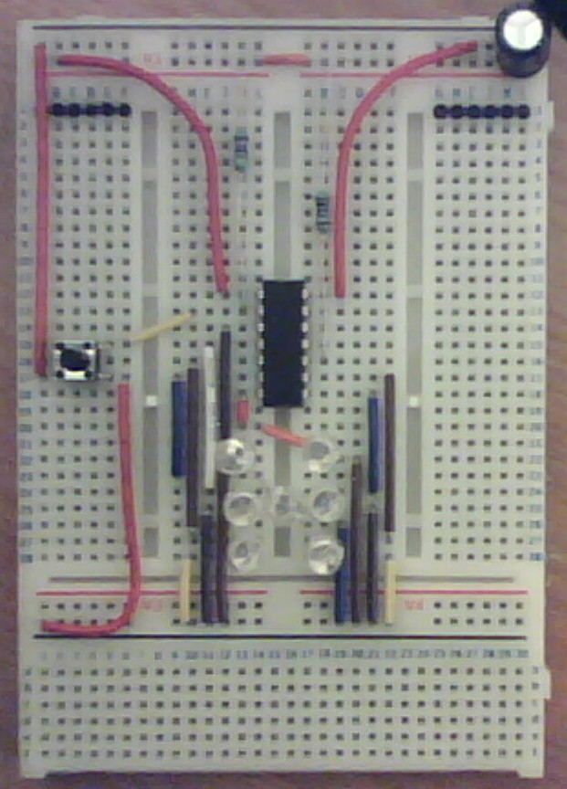
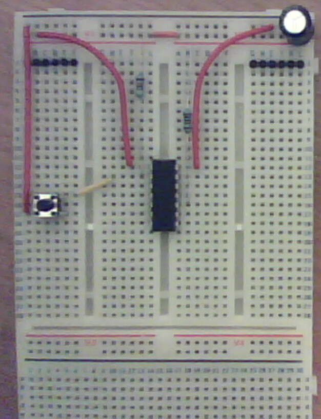
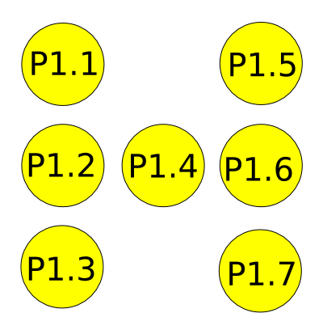
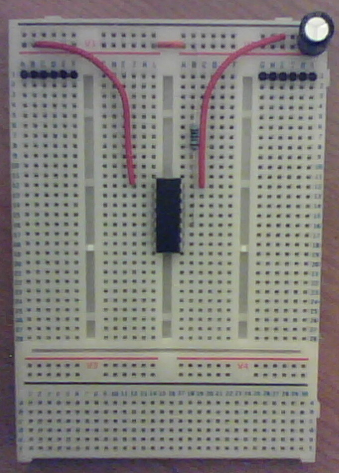

<LINK REL=StyleSheet HREF="http://jo.hnanthony.com/markdown.css" TYPE="text/css" MEDIA=screen>

# A $20 Introduction To Electronics For Programmers (via the MSP430 Launchpad)

## INTRODUCTION:

Hello there, prospective robotics expert of the future. In this document I will be detailing a simple hardware + software pairing for the MSP430 Microcontroller using Texas Instruments' excellent (and ridiculously cheap) Launchpad development board. The end result is a random number generator that will display its result in the form of a dice-like display using LEDs. Such a project will be suitable for mounting in perfboard and then in a project box with little effort if you want something to show off.

I suspect this project will cost you less than $20, but you can also splash out now and save yourself some money later - see step 0.

## ASSUMED KNOWLEDGE:

I'm assuming little-to-no knowledge of electronics and minimal knowledge of programming, although essentially this is a programmer's guide to microcontrollers and a gateway to robotics and other such fun things. I am assuming you are using a GNU+Linux distribution, although these tools and others are available for Windows and OS X - I just choose not to deal with those platforms. You will easily be able to find guides to getting a compiler working for those platforms and you may still benefit from reading up on (and implementing) this simple project for yourself.

I expect you to be able to install software from a repository or build a cross-compiler if your repository doesn't have one available (you shouldn't need to). I expect you to be able to use a compiler from the command line and GNU makefiles, else this information won't be very useful to you, but in reality you only need to be able to use a makefile I wrote.

The language we will be using is C, which I consider to be the only sane choice for microcontroller programming, but you can use anything you like via GCC front-ends if you are insane. The program is almost trivially small (get used to this if you are working with microcontrollers) and I won't be covering anything "complex" such as interrupts, although I will recommend further reading that will allow you to become an excellent microcontroller programmer.

## HARDWARE:

The components you will need are

* 220uF Electrolytic Capacitor
* 47K Resistor
* 1K Resistor
* SPST Momentary Switch
* 9x ~3v LED
* MSP430G2211 microcontroller from Texas Instruments or very similar
* MSP430 Launchpad
* Breadboard
* 2x 1.5V battery and battery holders or power source (depends on LEDs more than anything)
* Wires + wire strippers & cutters OR Jumper wires

## WHAT TO DO IF YOU GET STUCK:

#### "I don't understand this C"

Read The C Programming Language by Kernighan and Ritchie (Prentice Hall)

#### "I don't understand this electronics"

Read "Make: Electronics" by Charles Platt (O'Reilly)

#### "I can't get the software to build"

Read "Managing Projects with GNU Make" (O'Reilly)

## THE PROJECT:

### Step 0: Getting Your Hardware

Texas Instruments provide the Launchpad and it comes with two little microcontrollers, although people tell me they get different chips depending upon when they place their order. If you don't get a MSP430G2211 with your order you can buy one (buy several) - they are extremely cheap and you're probably going to break one or more at some point. You can also easily convert this project for use with other similar microcontrollers of the same family with very little hassle. The Launchpad itself is like $4.30. The next thing to do is go and get the data sheet for your chip from TI's website. We'll be using that later.

I've never been inside a RadioShack and Maplins is prohibitively expensive, but everything else on the components list can be bought there. eBay is an excellent source of cheap Chinese components if you don't mind waiting a couple of weeks for shipping. I recommend you just buy a big pack of assorted resistors and assorted electrolytic capacitors, which can be a bit pricey but is worth it in the long run. You may wish to read this whole project write-up before buying stuff if you're unsure - I will offer several options on the way through that may save you money or make you change your mind about the parts you wish to use.

Be sure to check the voltage requirements of your LEDs - you will need to buy battery holders as appropriate. For example, I will be using ~3V LEDs, so I would need a battery holder for 2 1.5V "AA" batteries in series or a power supply that can handle that voltage appropriately. The MSP430G2211 I'm using is rated at ABSOLUTE MAXIMUM 4.1V, which is listed in its data sheet, so be sure to check you're not using a voltage that may cause damage.

PROTIP: You can buy a simple DC power supply with a varying voltage and remove the connector to make an instant variable power supply for your breadboard, which would otherwise cost a lot of money.

### Step 1: Getting Your Software

You're going to need a bunch of software tools for your project. These are the Debian packages, which should be available for pretty much every distro. If it's not available for you, I suggest looking into how to make a cross-compiler.

* binutils-msp430 - Binary utilities supporting TI's MSP430 targets
* gcc-msp430 - GNU C compiler (cross compiler for MSP430)
* gdb-msp430 - The GNU debugger for MSP430
* msp430-libc - Standard C library for TI MSP430 development
* msp430mcu - Spec files, headers and linker scripts for TI's MSP430 targets

On top of this you will need some form of Make (I use GNU Make, like most people) and I provide a makefile along with the software of this project.

I have provided a [complete project on github](https://github.com/JohnAnthony/MSP430-Diceroller) that is designed to help you understand the software side of things.

### Step 2: Getting Your Program On The Chip

Alright, so, fire up your text editor and take a look at the code I wrote for this dice program. It's commented to all hell so should be pretty easy to follow. I'm assuming you're already a programmer, however, so that's not a primary concern for me. Lets get this code loaded up.

First and foremost, I have provided you with a makefile. Let me now step you through the stages to building and transferring this software for you.

1) Compile your C to an object file using msp430-gcc

    $ msp430-gcc -o roller.o roller.c

2) Compile all of your objects (just one in this case) into an appropriately formatted ELF file using msp430-gcc. Be sure to change your target architecture if you're using a slightly different chip. Yes, this is important because different chips use different offsets for locations of data within the ELF file. This is the file we will be using on our chip and the compiling process really is as easy as just that.

    $ msp430-gcc -mmcu=msp430g2211 -o roller.elf *.o

3) Using our msp430 debug tool (you can use this for handy-dandy online debugging) we load up our ELF file. Make sure your Launchpad is now connected via USB.

    $ mspdebug 
    (mspdebug) erase
    (mspdebug) load roller.elf
    (mspdebug) exit

### Step 3: Understanding the Chip

OK, so, time to take a proper look at this chip. If you didn't download the chip's data sheet in step 1 then [do so now](http://www.ti.com/product/msp430g2001). You may need a slightly different data sheet if you're using a different chip.

Take your time to peruse this and pick up as much information as you can. What we're really interested in, though, is what's detailed on page 4 - information about the device's pins. To orientate your chip with this diagram, place the chip down with the notch/groove facing towards the top of the page. You will also notice that the pin numbering starts at the top-left and goes anti-clockwise. We are interested only in the pin designations by port for now. Make a mental note of which pins the following ports are on:

    DVCC (This is connected to the positive side of our power supply)
    DVSS (This is connected to the negative side of our power supply)
    P1.0 (We use this for our switch)
    P1.1 (Used to light LED1)
    P1.2 (Used to light LED2)
    P1.3 (Used to light LED3)
    P1.4 (Used to light LED4)
    P1.5 (Used to light LED5)
    P1.6 (Used to light LED6)
    P1.7 (Used to light LED7)
    RESET (We just short this to prevent resets from happening)

And that's all there is to it. I'll cover how each of these is connected up individually momentarily. Just be aware that we're basically going to be giving the chip power (DVCC and DVSS), reading the status of a switch from P1.0 (input) and setting P1.1 through P1.7 to either "HIGH" (LED is on) or "LOW" (LED is off) depending upon the number we want to display.

### Step 4: Chip Meets Breadboard

OK, so, lets get this thing attached to some power and prevent it from resetting randomly because we have a floating RESET pin. I'll explain what that means in a second. Once that's done all that's left is to add the switch (step 5) and then our array of LEDs for the dice display (step 6).

Leave the batteries/power supply off for now - you'll just end up shorting it or some component and causing damage if you attach it this early. Place your chip over a channel in your breadboard somewhere around the middle or slightly offset towards the power supply end. Attach a wire to DVCC and your positive power rail. Do the same with DVSS and your ground (that's the negative power rail). When you attach your power supply your chip will now receive power.

Bridge your positive and ground power rails with your capacitor. The long leg or the capacitor goes on the positive side and the negative side is marked with a stripe on the capacitor body's casing. The reason you're doing this? Capacitors store energy and help prevent spikes and brown outs and this means such things have a much lower chance of damaging your chip. Think of it as a reservoir that fills up in the rainy season and releases what it has in times of drought to keep your water supply stable. This is excellent practise to get into when working with microcontrollers.

The last thing we need to do is set our reset pin to HIGH. That just means it needs to have potential nearing whatever we're supplying to DVCC (which in my case is +3V). Attach a 1K resistor to your RESET pin and your positive rail. the reason we're using a resistor is that you should never have precisely zero components between your positive and ground, else you are causing a short circuit and you're probably going to blow your power supply up. You'll see this come up again in the next section. If the RESET pin ever drops to LOW (connect it to ground) your chip will reset.

If the RESET pin isn't connected up properly it is *floating*, which basically just means we don't know what's on there and can't rely upon the pin to stay stable at either HIGH or LOW. We don't want that on any pin that will be read from.

### Step 5: Add Your switch

In our software, we use P1.0 as the port we check to see if our switch is pressed, so we now need to connect up a switch to this pin. Run a wire from P1.0 to your switch and then from your switch to ground. This means that whenever your switch is pressed, your potential on that pin goes near to ground aka LOW. When the switch isn't pressed we want the potential to be pulled up HIGH (else, so we need to connect P1.0 to your positive rail. When the switch is pressed, however, that would mean we just have a straight connection from positive to ground and that's a short. remember I said all the nasty stuff than can happen if you short out your power supply?

You always want a component between your positive and ground, so we're going to stuff in a resistor rather than just a wire. Use your 47K resistor to connect P1.0 to positive on the microcontroller side of your switch. Your switch will now pull P1.0 potential down LOW when pressed and P1.0 potential will go HIGH when the button isn't pressed. Hoorah!

### Step 6: LEDs

Alright, we're almost done! The next thing to do is connect your 7 LEDs to the appropriate pins. Those pins are set LOW by software initially and are then set HIGH by software to make our display. It really is just as simple as connecting each LED to a pin on one side and ground on the other. LEDs are polarity-sensitive, so connect the long leg to your pin and the short leg to ground.

The only trick to this step is all the wiring that needs to be done correctly, but it's really just repeating the same thing over and over. You also need to arrange your LEDs in an appropriate pattern to represent a dice face, which is also pretty easy:

And there you go! Connect your power supply to your positive and negative rails and press the button. You should see the thumper go around and when you release the button you should see an appropriate dice face.

Congratulations! You just wired up your first microcontroller!

   
 This work is licensed under a <a rel="license" href="http://creativecommons.org/licenses/by-sa/3.0/deed.en_US">Creative Commons Attribution-ShareAlike 3.0 Unported License</a>.

